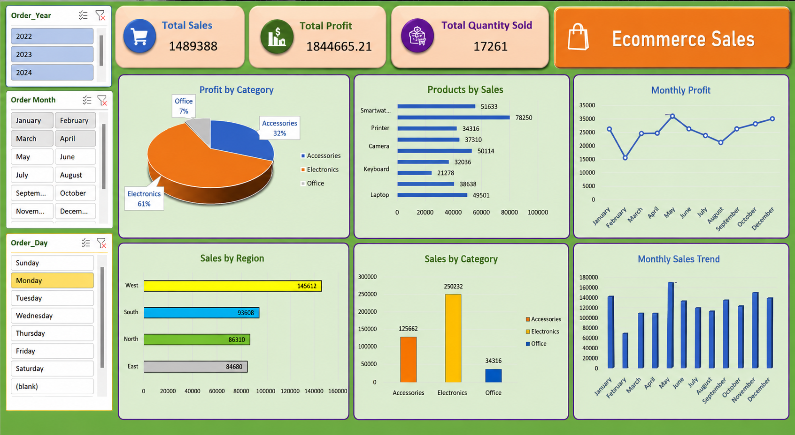

# Ecommerce Sales Dashboard in Excel

This project is an interactive Ecommerce Sales Dashboard created using Microsoft Excel to analyze sales performance, profit trends, quantity sold, and regional insights.

## Features
- KPI Cards
- Interactive Slicers
- Sales & Profit Analysis
- Monthly Trend Analysis
- Region-wise Insights
- Category-wise Performance

## Tools Used
- Microsoft Excel
- Pivot Tables
- Pivot Charts
- Slicers

## Dashboard Preview

